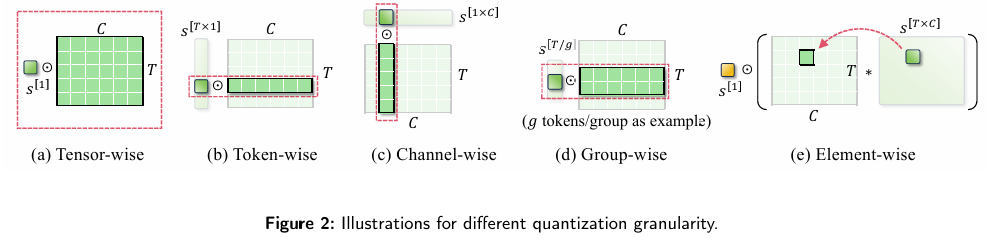
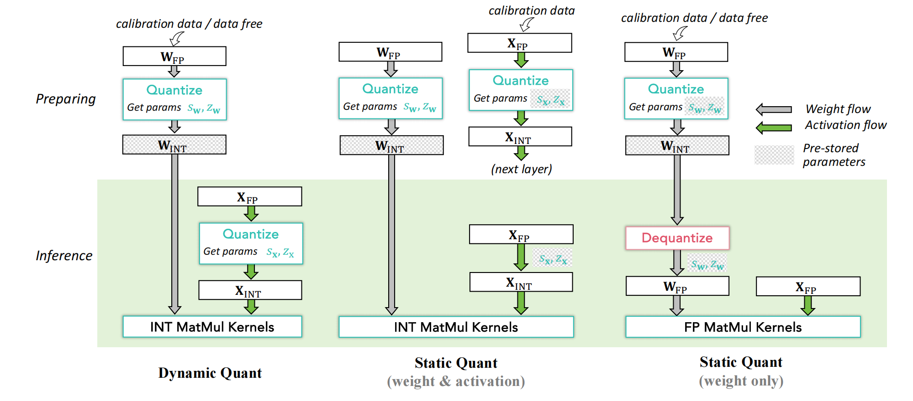
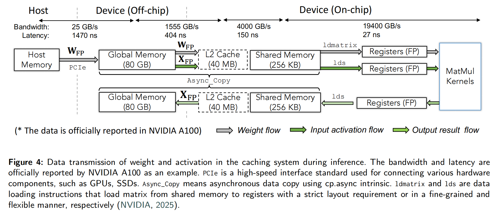
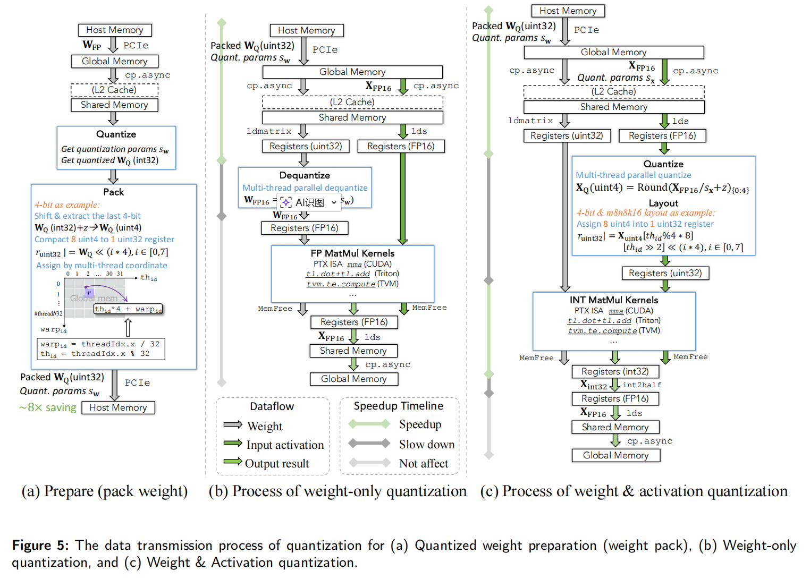
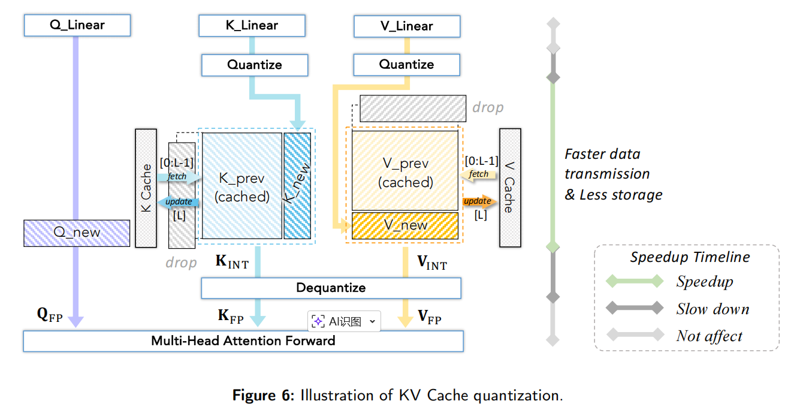
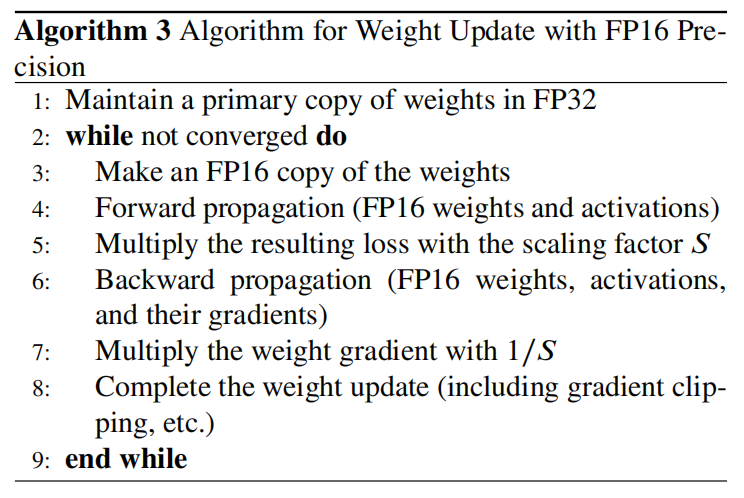
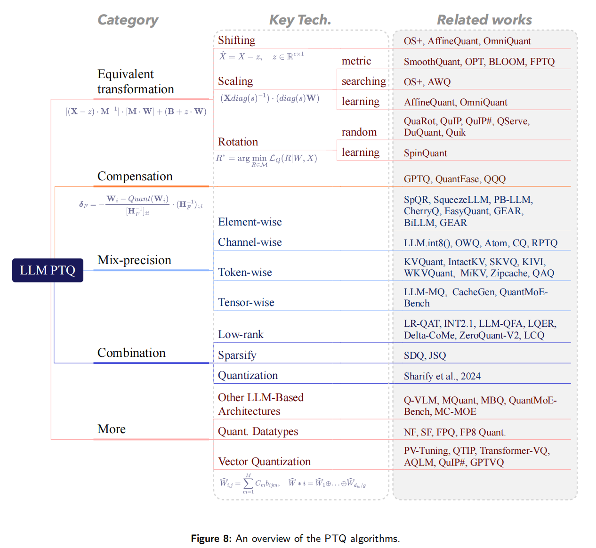

# A Survey of Low-bit Large Language Models: Basics, Systems, and Algorithms

https://doi.org/10.48550/arXiv.2409.16694

# 1. Introduction

LLM 部署成本高，主要瓶颈是：

1. **参数量巨大**，显存/内存占用高；
2. **推理时矩阵乘法和数据搬运开销大**；
3. **长上下文下 KV cache 会快速膨胀**；
4. **训练和微调还要存梯度、优化器状态、中间激活**，内存压力更大。

论文认为，**低比特量化** 是缓解这些问题的关键技术。量化的基本思想是把模型中的 **权重、激活、梯度、KV cache** 从 FP16/BF16/FP32 压缩成 INT8、INT4、FP8、FP4、二值/三值，甚至更复杂的自定义格式，从而降低存储和计算成本。

这篇综述的结构可以概括成：

> **低比特数值格式 → 量化粒度 → 动态/静态量化 → 推理框架与系统支持 → 低比特训练 → QAT/PTQ 推理量化算法 → 工具链与 benchmark → 未来方向**


# 2. Basics of Low-bit LLMs

论文第 2 节讲三个基础问题：

1. **用什么低比特数值格式表示？**
2. **按什么粒度量化？**
3. **动态量化还是静态量化？**

---

## 2.1 低比特数值格式

### 2.1.1 标准格式：FP、INT、Binary

**FP 浮点格式**

浮点数由符号位指数位，尾数位组成。
- 浮点数类型：

| 格式 | 总位宽 | 符号 / 指数 / 尾数位 | 最大正规数 | 最小正正规数 | 十进制有效位数 | 核心定位 |
|------|--------|-------------------|-----------|-----------|------------|------|
| FP32 | 32 位 | 1/8/23 | ~3.4×10³⁸ | ~1.175×10⁻³⁸ | 6~9 位 | 通用高精度基准 |
| FP16 | 16 位 | 1/5/10 | 65504 | ~6.1×10⁻⁵ | 3~4 位 | 边缘推理、图形渲染 |
| BF16 | 16 位 | 1/8/7 | ~3.4×10³⁸ | ~1.175×10⁻³⁸ | 2~3 位 | 大模型训练 / 推理主力 |
| FP8 E4M3 | 8 位 | 1/4/3 | 448 | 0.015625 | 1~2 位 | 权重 / 激活值计算 |
| FP8 E5M2 | 8 位 | 1/5/2 | 57344 | ~6.1×10⁻⁵ | ~1 位 | 梯度计算 |

**INT 整数量化**

整数是最主流的量化格式。核心是把连续浮点值映射到有限个离散整数。整数的好处是硬件友好、固定点计算快；坏处是对 outlier 敏感，因为离散点是等间距的。

**Binary / Ternary**

二值化是最激进的量化：只保留符号，例如 {-1, 1} 或 {0, 1}。它能带来极强压缩和潜在加速，但信息损失非常大。论文认为，LLM 二值化/三值化很有价值，但也非常困难，通常需要重新设计训练或架构。

---

### 2.1.2 专门为 LLM 设计的格式

LLM 的权重和激活经常有 outlier，所以一些论文设计了特殊数值格式。

**NormalFloat, NF**

NF 是 QLoRA 使用的格式。它不是均匀地把 [-1,1] 切成等距区间，而是假设权重近似服从正态分布，用正态分布分位点来放置量化点。这样每个 bin 期望包含差不多数量的值，信息利用率更高。论文指出 NF 主要用于 **weight-only quantization**。

**Micro Scaling FP**

Micro Scaling FP 用一个共享的 E8M0 scale 作用在一个小 block 上，block 内元素可以是 FP8、FP6、FP4、INT8 等。它的意义是：既保留较好的数值表示能力，又因为 scale 共享而更硬件友好。论文提到这是由 AMD、Arm、Intel、Meta、Microsoft、NVIDIA、Qualcomm 等产业成员共同推动的格式。

**Flint**

Flint 结合浮点和整数的优点。它用有限 bit 表示更大的动态范围，比纯 INT 更适合 LLM 参数的长尾分布。

**Abfloat**

Abfloat 专门处理 outlier。它和 Flint 类似，但会用更大的 exponent bias 扩大表示范围。论文强调它只用于 outlier，而普通值仍然用 INT4/INT8 或 Flint 存储。

**Student Float, SF**

SF 是 NF 的改进。NF 假设权重服从正态分布，而 SF 假设 LLM 的权重/激活更接近 Student-t 分布。Student-t 有更厚的尾部，更适合长尾/outlier 场景。论文后面也再次强调，SF4 是针对 LLM 分布统计重新设计的理论上更优格式。

---

## 2.2 量化粒度

核心原理：
```
x_int = round(x / scale) + zero_point
x_hat = (x_int - zero_point) * scale
```
量化时通常需要 scale 和 zero-point。**粒度**决定多少元素共享一组 scale/zero-point。



| 粒度 | scale 共享范围 | 常见用途 | 优点 | 局限 |
| --- | --- | --- | --- | --- |
| Tensor-wise | 整个 tensor 共用一个 scale | 最基础的整体量化 | 最快、元数据最少 | 最粗糙；tensor 内动态范围差异大时精度损失明显 |
| Token-wise | 每个 token 一个 scale | LLM 激活量化 | 能适配不同 token 的激活分布差异，更适合输入相关变化 | 比 tensor-wise 开销更高 |
| Channel-wise | 每个 channel 一个 scale | 权重量化 | 能适配不同通道的数值范围，精度通常更好 | 元数据和计算开销高于更粗粒度 |
| Group-wise | 每组 token 或 channel 共用一个 scale | 精度与开销的折中方案 | 兼顾量化精度和系统开销；例如每 128 个通道共享一个 scale | 仍然不如更细粒度灵活 |
| Element-wise | 每个元素一个 scale | 训练阶段或需极细粒度控制的场景 | 最精细，表达能力最强 | 推理开销太大，通常不会直接用于推理，常在推理前合并进权重 |

论文里还特别提到，**activation token-wise + weight channel-wise** 是常见组合，因为计算输出时可以把 token 方向和 channel 方向的 scale 合并，额外开销相对较小。


---

## 2.3 量化流程

论文解释了三种常见流程：动态量化、静态 W/A 量化、静态 weight-only 量化。


### 动态量化

权重提前量化好，但激活的 scale/zero-point 在推理时根据当前 batch 动态计算。优点是无需 calibration，部署简单，激活误差小；缺点是推理时多了计算 scale 的开销。

### 静态量化

用少量 calibration data 预先确定权重和激活的 scale。推理时直接用固定参数量化激活，然后走 INT GEMM。优点是推理更快；缺点是依赖 calibration 数据，且如果输入分布变化大，可能失准。

### Weight-only 静态量化

只量化权重，激活保持 FP16。推理时把低比特权重 dequantize 回 FP16，再和 FP16 激活做 FP GEMM。这类方法非常常见，比如 GPTQ、AWQ，因为它更容易保持精度，也更容易部署。

---

# 3. Frameworks and System Support

论文指出，一个算法把权重从 FP16 变成 INT4，并不自动意味着推理加速。真正的加速取决于：

1. 数据是否真的以紧凑格式存储；
2. 搬运路径上是否减少了字节数；
3. 是否有低比特 kernel；
4. dequantize/quantize 的额外开销是否小于节省的时间；
5. 硬件是否支持对应 bitwidth 的 MatMul。

---

## 3.1 Inference Framework for Quantization
LLM 推理不是单一过程，而是两阶段：

**Prefill**：一次性处理 prompt，生成上下文表示和 KV cache。这个阶段计算密集。

**Decode**：自回归逐 token 生成，每次只生成一个 token，但会读取已有 KV cache。这个阶段对内存带宽和 KV cache 更敏感。

所以量化优化也要分场景：

* Prefill 更看重矩阵乘法吞吐；
* Decode 更看重权重读取、KV cache 读取和 batch 规模；
* 长上下文时，KV cache 压缩会越来越重要。

---

## 3.2 系统层数据流




不同层级带宽差异极大：PCIe 到 device 的带宽远低于片上 shared memory/register 访问。因此 LLM 推理中很多时候瓶颈不是算力，而是 **数据搬运**。量化要真正加速，必须从底层系统支持数据压缩、搬运、解包、反量化和 kernel 计算。

这也是为什么 **weight-only quantization** 在 LLM 里特别有效：大模型权重太大，推理时搬权重成本高，压缩权重可以减少内存带宽压力。

---

## 3.3 量化系统数据流



解释了 weight-only 和 W/A 量化的数据流。weight-only 的流程是：
### weight-only

1. 离线计算 weight scale；
2. 把 FP 权重量化成低比特；
3. pack 成紧凑格式，例如 8 个 INT4 打包进一个 uint32；
4. 推理时读取 packed weight；
5. 在寄存器中 dequantize 回 FP16；
6. 与 FP16 activation 做 FP MatMul。

它的加速来自：**权重搬运减少**。
它的额外开销来自：**dequantize**。
只要省下的数据搬运时间大于 dequantize 时间，就能加速。


### Weight & Activation 
W/A 量化比 weight-only 更激进：

1. 权重低比特；
2. 激活也在推理时量化成 INT8/INT4/FP8；
3. 使用低比特 MatMul kernel；
4. 输出通常累加为 INT32 或其他高精度，再 cast 回 FP16。

它理论上更快，因为 MatMul 本身也低比特化。但它有两个难点：

* 激活 runtime quantization 有额外开销；
* 低比特 kernel 必须硬件支持。

论文提到一些系统工作专门优化数据类型转换，比如 QQQ 的 FastFP16toINT8、INT4→INT8、INT32→FP16 等；还有一些方法用 GEMV 或 LUT-based MatMul 来适配非标准 bitwidth。目前工业界最常用FP8 W8A8 + FP8 KV Cache。

---

## 3.4 KV Cache 量化

KV cache 每生成一个 token，都会把新的 K/V 存起来，后续 token 不用重新算前文。问题是：长上下文下 KV cache 占用随序列长度增长。

论文总结了 KV cache 量化的四类策略：

1. **直接低比特化**：例如 QoQ 压到 4-bit，KIVI 做 tuning-free 2-bit KV cache；
2. **窗口量化**：保留最近一段 full precision，超过窗口再批量量化，比如 SKVQ；
3. **跳过新 token 的 dequantization**：例如 WKVQuant，把新的 K/V 先以 FP 参与当前计算，再量化存入 cache；
4. **处理 token-wise outlier**：特殊 token 或低语义 token 可能形成 outlier，需要高精度保留或单独处理。

对长上下文部署来说，这一节非常重要。论文未来方向也强调，KV cache 压缩会成为重点。

## 3.5 量化与反量化（Quantization and Dequantization）

### 3.5.1 浮点量化与反量化

浮点量化看起来只是“把 FP16 变成 FP8”，但底层并不是简单截断。它本质上是在更小的 exponent 和 mantissa 预算下，重新编码原来的浮点数。

以 `FP32 -> FP8` 为例，算法流程：

1. **先 scale**：低比特浮点的表示范围更小，如果直接 cast，很多值会溢出或下溢，所以通常先把 tensor 缩放到更适合目标格式的范围里。这个 scale 一般通过 calibration 或训练学习得到。
2. **检查 overflow / underflow**：
   - 如果值超过目标 FP 格式的上界，就直接截到最大/最小可表示值；
   - 如果值太小，连最小正规数都放不下，就进入 subnormal 的处理逻辑。
3. **复制符号位和指数位，再对 mantissa 做舍入**：目标格式 mantissa 更短，所以精度损失主要发生在尾数截断和 rounding 上。

反量化：从低比特 FP 转回高比特 FP 时，目标格式的 exponent 和 mantissa 位数都更多，所以可以把原来的符号位、指数位、尾数位复制到高位，再把剩余位补零即可。  
这种“反量化”不会恢复被截掉的 mantissa 信息，它只是把低比特浮点值**无损地嵌入**到更高比特格式中，便于后续计算。

可以把浮点 Q/DQ 理解成：

* 量化时最麻烦的是“如何在更小动态范围里保住尽量多的信息”；
* 反量化时最麻烦的不是数学，而是**高效实现格式转换**。

### 3.5.2 整数量化与反量化

整数量化是最主流的路径。它的核心思想是：把连续浮点值映射到一组等间隔的离散整数上，再用 scale 和 zero-point 把它们解释回近似的实数。

常见写法可以概括成：

```text
q = clip(round(x / s) + z)
```

其中：

* `s` 是 scale，决定量化步长；
* `z` 是 zero-point，用来把实数 0 对齐到整数域中的某个值；
* `clip` 保证结果落在目标 bitwidth 的表示范围内。

反量化则是：

```text
x_hat = (q - z) * s
```

* 量化时先把浮点值“除以步长”，映射到整数格点；
* 反量化时再把整数“乘回步长”，恢复到原始数值尺度。


以 `FP32 -> INT4` 为例，整数量化算法流程：

1. **缩放并取整**：把 FP 值变成 INT；
2. **pack**：把多个低比特值打包进更大的机器字；
3. **unpack / dequantize**：计算前再把它们解出来；
4. **乘对应粒度的 scale**：恢复数值幅度。

以 `INT4` 为例，单个数只有 4 bit，GPU 不会按“半字节”直接高效搬运，所以常见做法是：

* 先把量化值转成 unsigned 形式；
* 每 8 个 `INT4` 打包成 1 个 `uint32`；
* 推理时按相同布局 unpack，再进入 dequantize 或 MatMul kernel。

这样做的收益

* 内存占用大幅下降；
* host memory 到 global memory，再到片上 cache 的搬运字节数都减少。

但系统代价也随之出现：

* pack / unpack 需要位运算；
* dequantize 需要乘 scale；
* 如果是非标准 bitwidth，比如 INT3 / INT5 / FP6，布局和转换逻辑会更复杂。

#### scale 是怎么来的

`s` 可以有几种来源：

* 直接由 `max/min` 初始化；
* 从候选集合里搜索一个更优的 `s`；
* 把 `s` 作为可学习参数。

这件事的重要性在于：**dequantize 只是线性恢复，但恢复质量几乎完全取决于 scale 选得对不对。**  
所以很多 PTQ 方法真正优化的不是“整数乘法”，而是“如何找到更好的 scale 和 rounding”。

#### 为什么 dequantize 常常是瓶颈

从系统角度看，很多量化方法最终卡的不是 MatMul，而是 datatype conversion。

例如：

* `weight-only` 量化里，权重虽然低比特存储，但计算前通常要先 dequantize 回 FP16；
* `W/A` 量化里，激活需要在 runtime 从 FP16 量化到 INT8/INT4，输出又常常要从 `INT32` cast 回 `FP16`。

所以推理路径里常会出现三类热点转换：

1. `FP16 -> INT8/INT4`：激活量化；
2. `INT4 -> INT8/FP16`：权重解包和反量化；
3. `INT32 -> FP16`：低比特 MatMul 后的输出回写。

论文提到的 QQQ 就是在优化这些 conversion kernel，比如更快的 `FP16 -> INT8`、`INT4 -> INT8`、`INT32 -> FP16`。  

### 3.5.3 二值化与反量化

二值化是最激进的量化形式。它通常不再把值映射到多级整数，而是只保留一个 bit，例如：

* 用 `sign` 表示 `{-1, +1}`；
* 用 `bool` 表示 `{0, 1}`。

它的系统优势非常大：

* 存储压缩最强；
* 可以利用 bitwise 指令和 `popcount` 这类操作加速矩阵乘。

但它的代价也最大，因为大量幅值信息被直接抹掉了，只剩下符号或真假。  

二值化后的“反量化”通常只是乘一个 scale：

```text
x_hat = alpha * b
```

其中 `b` 是二值结果，`alpha` 用来恢复原 tensor 的整体幅度。  
这种恢复非常粗糙，因此二值化的关键不是反量化本身，而是：

* 用什么二值编码；
* 如何在 kernel 里把 bitwise accumulation 映射回我们想要的数值语义。

# 4. Quantization Strategies for Efficient LLM Training

## 4.1 BF16 / FP16 / FP8 / INT8 训练

### BF16 / FP16


BF16 是当前 LLM 训练常用格式，因为指数位多，训练稳定。但需要硬件支持。FP16 指数位少，容易 overflow/underflow，所以需要 loss scaling。 Algorithm 3 展示了 FP16 训练流程：保留 FP32 主权重，前向/反向用 FP16，loss 乘 scaling factor，反向梯度再除S，unscale和后续梯度检查、optimizer update、master weight update一般在FP32中进行。

### FP8 training

FP8 训练依赖 NVIDIA/AMD 等硬件和 Transformer Engine。FP8 的动态范围不足以用一个全局 loss scale 覆盖所有 tensor，因此需要 **每个 FP8 tensor 独立 scaling factor**，拿一个线性层举例,不只是梯度tensor，前向激活和权重输入也会有动态范围问题：
```
Y = XW
X：输入激活张量
W：权重张量
Y：输出激活张量
反向时又会有：
dY：输出梯度
dX：输入梯度
dW：权重梯度
在 FP8 训练里，这些张量往往都可能各自有自己的 scale。
```
常用 delayed scaling：根据之前若干 iteration 的 amax 历史来选 scale，而不是每步在线计算。


### INT8 training

INT8 训练更难，因为反向传播中的量化不稳定，可能导致训练崩溃。论文列举了 QST、Q-GaLore、Jetfire、4-bit Optimizer 等方法。Q-GaLore 的一个亮点是将 projection matrix 存成 INT4、weights 存成 INT8，使 Llama-7B 可以在单张 16GB GPU 上从头训练。

> BF16/FP16 风险较低，已经广泛使用；FP8 在特定模块和硬件上有效，但精度风险更高；INT8 训练风险最高，目前研究多、实践还没有普遍。

---

## 4.2 量化 + PEFT

LLM 微调时，内存不仅来自权重，还来自梯度、优化器状态、中间激活。PEFT 的目标是只训练少量参数。

### 4.2.1 Partial Parameter Fine-Tuning with Quantization

传统 QAT 接近全量训练，开销大。于是一些方法只更新部分参数。例如：

* PEQA：量化权重后，只训练 scale；
* OWQ：只更新 mixed precision 中保留高精度的 weak columns。

这类方法的核心思想是：**不要训练所有权重，只训练最影响量化误差的少量参数。**

---

### 4.2.2 Low-bit Low-Rank Adaptation

LoRA 冻结原始权重，只训练低秩矩阵 A、B。但原始模型权重仍然要存，所以显存仍然大。QLoRA 进一步把 frozen base model 量化到低比特，forward 变成：

> Y = X · dequant(Wq) + X · A B

这样优化器只需要保存 LoRA 参数的梯度，基础模型权重也低比特存储。QLoRA 使用 NormalFloat 和 double quantization，单张 48GB GPU 可微调 65B 模型。

后续方法包括：

* **IR-QLoRA**：引入信息论校准；
* **LoRA+**：A/B 矩阵使用不同学习率；
* **QDyLoRA / Bayesian-LoRA**：动态或贝叶斯式 rank 分配；
* **QA-LoRA**：希望 fine-tune 后能把 LoRA 无损 merge 进 INT 权重，部署无额外开销；
* **L4Q**：同时更新 quantizer 参数，得到可直接部署的量化模型；
* **LoftQ / LQ-LoRA**：关注 LoRA 初始化，使 W ≈ Wq + AB，减少量化误差。


---

# 5. 推理量化算法：QAT 和 PTQ

**QAT, Quantization-Aware Training**
训练或微调时模拟量化，让模型适应低精度。

**PTQ, Post-Training Quantization**
给定预训练 FP 模型和少量 calibration data，不做端到端训练，直接得到量化模型。

---

## 5.1 QAT：极低比特更需要

LLM-QAT
BitDistiller
EfficientQAT
BitNet / BitNet b1.58

> QAT 适合 ultra-low-bit，尤其是 1/2/3-bit；但训练复杂、资源要求高。实际更推荐从预训练模型做 QAT fine-tuning，而不是从头训练。

---

## 5.2 PTQ：论文最重要的分类

论文 Figure 8 给出了 PTQ 方法

---

## 5.2.1 Equivalent Transformation：处理 outlier 异常值

如果一个 channel 中有极大值，量化范围就会被 outlier 拉大，普通值只能挤在很少的格点里，误差巨大。

Equivalent Transformation 的核心是：

> 在不改变 FP 模型输出的前提下，重分布 weight/activation，让 outlier 更平滑、更对称、更容易量化。

论文把它分成三类：shifting、scaling、rotation。

---

### Shifting Transformation

目标是处理 activation 的不对称 outlier。

OS+ 使用 channel-wise shift：

> X̂ = X − Δ

其中 Δ 是每个 channel 的 shift。简单做法是取该 channel 最大值和最小值的中点。这样可以减少整体范围。OmniQuant、AffineQuant 则把 Δ 变成可学习参数，用 block-wise quantization error minimization 来优化。

直觉：
如果某个 channel 的分布偏移很大，先把它“居中”，再量化会更好。

---

### Scaling Transformation

Scaling 处理的是 outlier 幅值过大的问题。

SmoothQuant 是代表方法：把 activation 中难量化的大幅值转移到 weight 中，使 activation 更平滑。因为 weight 是静态的，更容易离线处理。AWQ 则发现重要 weight channel 和 activation scale 相关，因此用 activation-aware 的方式保护 salient weight channels。论文给出 AWQ 的搜索目标，用一个超参数 α 平衡显著通道和非显著通道。

直觉：
**activation 难量化，就把难度“搬”到 weight；weight 难量化，就保护重要 channel。**

---

### Rotation Transformation

Rotation 是近年来 LLM 4-bit 量化非常重要的路线。

QuIP 的洞察是：如果 weight 和 Hessian 不够 incoherent，量化误差会集中在某些坐标轴方向。通过正交矩阵旋转 weight，可以让数值分布更均匀，outlier 更少。后续 QuaRot、QuIP#、SpinQuant、QServe、DuQuant 等都属于这个方向。论文指出，QuIP 使用 Kronecker-structured orthogonal matrices 来降低额外计算。

直觉：
不是直接裁剪 outlier，而是“旋转坐标系”，让 outlier 不再集中在某个维度。

---

## 5.2.2 Compensation：补偿量化误差

Equivalent Transformation 主要是让模型更“好量化”；Compensation 则是在量化后补偿误差。

代表方法是 **GPTQ**。GPTQ 的思想来自 Optimal Brain Quantization/Compression：逐列量化权重时，用 Hessian 信息估计某个权重量化对输出误差的影响，然后把误差传播/补偿到还没量化的权重上。

论文把 GPTQ、QuantEase、QQQ 等归到 compensation 类。

我的理解是：

* SmoothQuant/AWQ/QuaRot 是“量化前把分布改好”；
* GPTQ 是“量化过程中边量化边修正”。

两类方法经常可以组合。

---

## 5.2.3 Mixed Precision：不同位置给不同 bit

统一 INT4 很简单，但不是最优。LLM 不同层、不同 channel、不同 token 的敏感度不同，因此 mixed precision 很自然。

论文按粒度分成：

### Element-wise mixed precision

例如 SpQR、SqueezeLLM、PB-LLM、CherryQ、EasyQuant、GEAR、BiLLM 等。一般思想是：大部分值低比特，少量 outlier 或重要值高精度保存。

### Channel-wise mixed precision

代表方法包括 LLM.int8()、OWQ、Atom、CQ、RPTQ。比如 LLM.int8() 会把 outlier channels 单独高精度处理；RPTQ 会 reorder channels，把范围相近的通道聚到一起再量化。

### Token-wise mixed precision

主要用于 KV cache。论文提到 KVQuant、IntactKV、SKVQ 发现特殊 token 或低语义 token 可能造成 token-wise outlier，因此要高精度保留；KIVI、WKVQuant 会保留最近 KV cache 为 full precision，而量化过去 KV cache；MiKV、Zipcache、SnapKV、QAQ 则根据重要性指标保留重要 KV。

### Tensor-wise mixed precision

例如 LLM-MQ、CacheGen、QuantMoE-Bench。CacheGen 发现早期层的 KV cache value 损失更敏感，因此给早期层更高 bit。QuantMoE-Bench 则研究不同 MoE block、expert、linear layer 的 bit 分配。

---

## 5.2.4 Combination：量化与其他压缩方法结合

论文认为，在极高压缩率下，仅靠低比特量化表示能力不足，所以需要和其他压缩方法结合。

### Low-rank + Quantization

例如 LR-QAT、INT2.1、LLM-QFA、LQER、Delta-CoMe、ZeroQuant-V2、LCQ。

这类方法的核心是：量化误差通常可以用低秩结构近似，因此用 LoRA/SVD/低秩补偿来修复量化输出。例如 LR-QAT 通过 LoRA 形式做参数高效 QAT；INT2.1 用 LoRA 把优化目标从单层误差转向整体模型输出误差；LQER 用 SVD 分解量化误差并重建。

### Sparsity + Quantization

比如 SDQ、JSQ。稀疏化减少非零参数，量化减少每个参数 bit，两者可以叠加压缩。

### Quantization + Quantization

论文提到，也可以把不同量化技术组合，比如 SmoothQuant + GPTQ。它强调 equivalent transformation 和 compensation 往往是正交的，可以组合探索。

---

## 5.2.5 新架构：MLLM 和 MoE 量化

这部分和你之前关心的 MLLM 量化很相关。

论文指出，除了传统 dense LLM，MLLM 和 MoE 的量化开始受到关注。

### MLLM

* **Q-VLM**：第一个面向 MLLM 的 PTQ 框架，通过挖掘 cross-layer dependency，在离散误差和搜索成本之间做折中；
* **MQuant**：静态量化方案，为视觉模态和语言模态使用独立量化参数，并缓解 online Hadamard rotation 带来的 weight outlier；
* **MBQ**：考虑语言和视觉模态敏感性差异，通过调整 reconstruction loss 来求 channel-wise equalization factors。

核心问题是：
**MLLM 不是单一文本分布，视觉 token 和语言 token 的分布、敏感性、误差传播方式都不同。**

### MoE

* **QuantMoE-Bench**：探索 MoE 结构感知 mixed precision；
* **MC-MOE**：把 expert 的 bit allocation 转化为线性规划问题，平衡专家重要性。

MoE 的难点是 expert 不均衡，不同 expert、router、block 的敏感度不同。

---

## 5.2.6 更多量化形式：NF/SF/FP/VQ

论文指出，除了 integer quantization，还有很多形式可以把平均 bitwidth 压到 4-bit 或更低；它们不一定加速显著，但常常精度更好。

### More Quantization Datatypes

* **NF**：假设正态分布，信息论上让每个 bin 分到相近数量的值；
* **SF**：假设 Student-t 分布，更适合 LLM 的厚尾分布；
* **FP quantization**：比如 FPQ、FP8 quantization，可以灵活分配 exponent/mantissa，更适合长尾或钟形分布。

### Vector Quantization, VQ

VQ 不是单个元素量化，而是把一组维度作为 vector，选择 codebook 中的向量来表示。论文提到 AQLM、QuIP#、GPTVQ、PV-Tuning、QTIP 等。VQ 的潜力是超低比特高精度压缩，但通常需要复杂 codebook 和特殊 kernel。

对 PTQ 的总结：

> 标准 PTQ 中，shifting/scaling/rotation 可以缓解 outlier；GPTQ 等 compensation 可以进一步降低误差；高精度优先可以用 mixed precision；高压缩率优先可以结合 low-rank 和 sparsity；未来还可以探索新数据格式、新量化函数、MLLM/MoE 等新架构。

---

# 6. 工具链和 Benchmark

总结量化工具和评测。
LLMC、LMQuant、MI-optimize 等工具比较适合做多算法复现和公平比较；如果目标是跨推理框架部署，LLMC 更突出，因为它有灵活量化设置和多后端兼容。

评测指标分两大类：

### 效率

* deployability：能不能真正部署；
* throughput：吞吐；
* storage saving：存储节省；
* calibration time：PTQ 生产量化模型的时间成本。

理论上参数变小会加速，但实际是否加速取决于系统实现，所以 benchmark 必须测真实 throughput，而不能只看 bitwidth。

### 生成质量

包括：

* perplexity；
* accuracy；
* reasoning / logic；
* completion；
* trustworthiness；
* robustness；
* dialogue；
* long-context；
* multitask；
* safety。

---

# 7. 具体算法
#### GPTQ       
