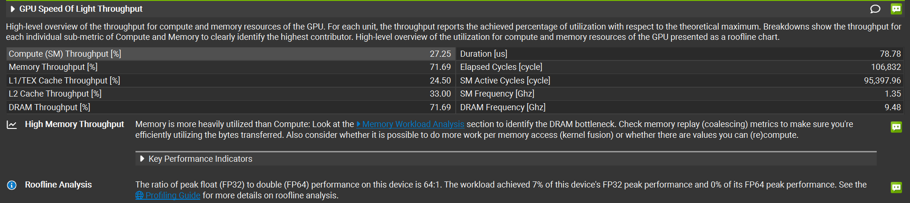

# Softmax算子实现与优化
## 计算公式
给定一个向量 $\mathbf{x} = [x_0, x_1, ..., x_{N-1}]$，Softmax 将其转换为概率分布：
$$\text{softmax}(x_i) = \frac{e^{x_i}}{\sum_{j=0}^{N-1} e^{x_j}}$$
直接计算 $e^{x_i}$ 会有数值上溢/下溢
可以使用：
$$\text{softmax}(x_i) = \frac{e^{x_i - \max(\mathbf{x})}}{\sum_{j} e^{x_j - \max(\mathbf{x})}}$$
- 三步计算流程：
```
输入 x = [x0, x1, ..., x_{N-1}]

Step 1: m = max(x0, x1, ..., x_{N-1})          ← 第一次遍历：归约求最大值
Step 2: s = Σ exp(xi - m)                       ← 第二次遍历：归约求指数和
Step 3: output_i = exp(xi - m) / s              ← 第三次遍历：逐元素归一化
```

## CPU实现
```cpp
void softmax(const float* input, float* output, int M, int N) {
    for (int row = 0; row < M; row++) {
        const float* x = input + row * N;
        float* y = output + row * N;
        // max
        float max_val = x[0];
        for (int i = 1; i < N; i++) {
            if (x[i] > max_val) max_val = x[i];
        }
        // sum of exp
        float sum = 0.0f;
        for (int i = 0; i < N; i++) {
            sum += expf(x[i] - max_val);
        }
        // normalize
        for (int i = 0; i < N; i++) {
            y[i] = expf(x[i] - max_val) / sum;
        }
    }
}
```


## CUDA实现一：一个block处理一行
每一行分配一个 Block，Block 内的线程协作完成归约。如果一行有 N 个元素且 N > block_size，每个线程需要处理多个元素。

```cpp
__global__ void softmax_v1(const float* input, float* output, int M, int N){
    int row = blockIdx.x;
    int tid = threadIdx.x;
    const float* x = input + row * N;  //当前行
    float* y = output + row * N;
    //max
    float local_max = -INFINITY;
    for (int j = tid; j < N; j += blockDim.x) {
        local_max = fmaxf(local_max, x[j]);
    }
    extern __shared__ float smem[];
    smem[tid] = local_max;
    __syncthreads();
    //树形归约求max
    for(int s = blockDim.x / 2; s > 0; s >>= 1 ){
        if(tid<s){
            smem[tid] = fmaxf(smem[tid],smem[tid+s]);
        }
        __syncthreads();
    }
    float row_max = smem[0];
    //求和
    float local_sum = 0.0f;
    for(int j = tid; j<N; j+=blockDim.x){
        local_sum+=expf(x[j]-row_max);
    }
    smem[tid] = local_sum;
    __syncthreads();
    for(int i = blockDim.x / 2 ; i>0; i>>=1){
        if(tid<i){
            smem[tid] = smem[tid]+smem[tid+i];
        }
        __syncthreads();
    }
    float row_sum = smem[0];
    // normalize
    for(int j = tid; j<N;j+=blockDim.x){
        y[j] = expf(x[j]-row_max)/row_sum;
    }
}
```

对比CPU的实现：对于[1024,4096]的输入数据
```cpp
int block_size = 256;
int grid_size = M;  // 每行一个 block
size_t smem_size = block_size * sizeof(float);
softmax_v1<<<grid_size, block_size, smem_size>>>(d_input, d_output, M, N);
```
得到结果：
```
CPU:      39.230 ms
GPU v1:   0.075 ms  
Speedup: 524.2x  
```
### 性能瓶颈分析


#### 1. GPU Speed Of Light (SOL) 总览
| 指标 | 值 |
|------|-----|
| Compute (SM) Throughput | 27.25% |
| Memory Throughput | 71.69% |
Memory 远高于 Compute → **memory-bound** kernel。优化方向应该是**减少全局内存访问次数**，而非优化计算。

#### 2. Kernel Details
| 指标 | 值 | 分析 |
|------|-----|------|
| Duration | 78.78 μs | |
| Registers/Thread | 20 ||
| Shared Memory | 1.02 KB ||
| Block Size | 256 | 8 个 warp|
| Achieved Occupancy | 87.53% (理论 100%) | 差距约 12%，说明有部分 SM 资源未被完全利用 |
| Waves per SM | 2.08 | 所有 block 需要分3轮才能让每个 SM 都跑完,最后一轮浪费较多 |

Occupancy = SM 上**实际活跃的 warp 数** / SM 上**理论最大 warp 数**
RTX 3090（SM86）的硬件限制：
- 每 SM 最多 **1536 个线程** = **48 个 warp**
- 每 SM 最多 **16 个 block**
- 每 SM 寄存器文件 **65536 个**
- 每 SM Shared Memory 最大 **100 KB**
对于kernel（block_size=256, 20 registers/thread, 1KB shared memory）：
**1. Block 数量限制**
$$\lfloor 48 \div 8 \rfloor = 6 \text{ blocks}$$（每 block 8 个 warp，48 warp 上限）
每 SM 最多 16 个 block，不构成瓶颈。
**2. 寄存器限制**
$$\lfloor \frac{65536}{20 \times 256} \rfloor = \lfloor 12.8 \rfloor = 12 \text{ blocks}$$
不构成瓶颈。→ 
**3. Shared Memory 限制**
每 block 用约 1 KB，100KB 上限
**取最小值：6 blocks → 6 × 256 = 48 warp**
$$\text{Theoretical Occupancy} = \frac{48}{48} = 100\%$$
理论值是 100%，但实际 Achieved Occupancy 只有 87.53%，差距可能来自运行时的动态因素：grid 中总 block 数不能被所有 SM 整除、kernel 尾部 SM 空闲、warp 调度不均匀等。

#### 3. Memory Workload Analysis
| 指标 | 值 | 分析 |
|------|-----|------|
| Global Memory Throughput | 652.71 GB/s | 3090 理论峰值 936 GB/s，利用率 69.7% |
| L1/TEX Hit Rate | 19.03% |说明几乎没有数据复用——每次循环都从 global memory 重新读取 |
| L2 Hit Rate | 34.59% | |
| Shared Memory Bank Conflict | load: 980, others: 2441 | |

**关键问题**：L1 命中率只有 19%，根本原因是 `x[j]` 被**读了 3 遍**（求 max、求 sum、normalize 各一次）。每次遍历的数据量 `1024×4096×4B = 16MB`，远超 L1/L2 缓存容量，所以每次遍历都要重新从 DRAM 读取。
**Bank Conflict 来源**：可能来自硬件层面的调度，但是影响不大 bank conflict < 1%

#### 4. Warp State Statistics
| Stall 原因 | cycles/instruction | 分析 |
|------------|-------------------|------|
| **Long Scoreboard** | **24.63** | 等待全局内存返回数据，远超其他原因，是**主要瓶颈** |
| Short Scoreboard | 0.96 | 等待 shared memory / L1 操作完成，较低 |
| Barrier | 1.98 | `__syncthreads()` 等待，归约中较快线程等慢线程 |
| Not Selected | 1.22 | warp 就绪但未被调度器选中（warp 之间竞争） |


#### 5. Source Counters（热点代码）
三行热点代码都在全局内存循环中：
```cpp
local_max = fmaxf(local_max, x[j]);     
local_sum += expf(x[j] - row_max);      
y[j] = expf(x[j] - row_max) / row_sum;   
```
每行 N=4096 个 float 被读了 3 次，写了 1 次。**理论最少只需读 1 次写 1 次**。

#### 现存的问题
1. 主要：全局内存读 3 次 
2. exp计算两次
3. 树形规约有wrap divergence：当s<32时只有部分线程工作
4. __syncthreads()过多，**并且s<32时wrap内天然同步，不需要__syncthreads()**


## CUDA实现二：warp shuffle 归约
### 核心改进
使用warp shuffle代替树形归约，消除warp divergence和多余的__syncthreads()
Warp Shuffle 指令允许同一 Warp 内的线程**直接交换寄存器中的值**，不需要经过 Shared Memory(适用于 归约，扫描，广播等) 
### Warp 级归约工具函数
```cpp
// Warp 内求最大值
__device__ float warp_reduce_max(float val) {
    val = fmaxf(val, __shfl_xor_sync(0xffffffff, val, 16));//XOR 的性质保证交换是对称的（lane 0 和 lane 16 互换），所以每一步之后所有线程都持有相同的归约结果
    val = fmaxf(val, __shfl_xor_sync(0xffffffff, val, 8));
    val = fmaxf(val, __shfl_xor_sync(0xffffffff, val, 4));
    val = fmaxf(val, __shfl_xor_sync(0xffffffff, val, 2));
    val = fmaxf(val, __shfl_xor_sync(0xffffffff, val, 1));
    return val;  // 所有 lane 都持有 warp 内的 max，__shfl_xor_sync天然广播给所有 lane。
}

// Warp 内求和
__device__ float warp_reduce_sum(float val) {
    val += __shfl_xor_sync(0xffffffff, val, 16);
    val += __shfl_xor_sync(0xffffffff, val, 8);
    val += __shfl_xor_sync(0xffffffff, val, 4);
    val += __shfl_xor_sync(0xffffffff, val, 2);
    val += __shfl_xor_sync(0xffffffff, val, 1);
    return val;
}
```


### Block 级归约函数（Warp Shuffle + Shared Memory 混合）
当 Block 超过一个 Warp（> 32 线程）时，需要两阶段归约：
```cpp
__device__ float block_reduce_max(float val){
    int lane_id = threadIdx.x % 32;
    int warp_id = threadIdx.x / 32;
    constexpr int MAX_WARPS = 32;
    val = warp_reduce_max(val);
    __shared__ float warp_maxes[MAX_WARPS];
    if(lane_id == 0){
        warp_maxes[warp_id] = val;
    }
    __syncthreads();
    int num_warps = blockDim.x / 32;
    val = (lane_id < num_warps) ? warp_maxes[lane_id] : 0.0f;
    val = warp_reduce_max(val);
    return val;
}

__device__ float block_reduce_sum(float val){
    int lane_id = threadIdx.x % 32;
    int warp_id = threadIdx.x / 32;
    constexpr int MAX_WARPS = 32;
    __shared__ float warp_sums[MAX_WARPS];
    val = warp_reduce_sum(val);
    if(lane_id == 0){
        warp_sums[warp_id] = val;
    }
    __syncthreads();

    int num_warps = blockDim.x / 32;
    val = (lane_id < num_warps) ? warp_sums[lane_id] : 0.0f;
    val = warp_reduce_sum(val);
    return val;
}
```

### V2 完整 Kernel
```cpp
__global__ void softmax_v2(const float* input, float* output, int M, int N) {
    int row = blockIdx.x;
    int tid = threadIdx.x;
    const float* x = input + row * N;
    float* y = output + row * N;
    // Step 1: 求最大值
    float local_max = -INFINITY;
    for (int j = tid; j < N; j += blockDim.x) {
        local_max = fmaxf(local_max, x[j]);
    }
    float row_max = block_reduce_max(local_max);
    //
    float local_sum = 0.0f;
    for(int j = tid; j< N; j+=blockDim.x){
        local_sum += expf(x[j]-row_max); 
    }
    float row_sum = block_reduce_sum(local_sum);
    //
    for(int j = tid; j<N; j+=blockDim.x){
        y[j] = expf(x[j]-row_max)/row_sum;
    }
}
```

### V2 相比 V1 的改进
归约方式 : v1 Shared memory树形归约 ,每次归约需要同步log(256) = 8次，和8次的smem读写
v2 : Warp shuffle + shared memory 混合,只需要同步1次，，和五次的shuffle操作

性能比较:
```
CPU:      39.230 ms
GPU v1:   0.075 ms  Speedup: 524.2x  Correctness: PASSED
GPU v2:   0.072 ms  Speedup: 541.2x  Correctness: PASSED
v2 vs v1: 1.03x
```

分析ncu指标：
Duration [us]	78.78 -> 74.21 提升并不大，global memory 三次访存并未解决
stall barrier   1.98 -> 1.23 同步次数减少，stall barrier有明显下降
stall Not Selected 1.22 -> 1.37 GPU有更多的就绪 warp 可供选择

## CUDA实现三：减少global memory访问
v2中读取global memory三次，第二次和第三次都是读取x[j]做expf(x[j]-row_max)，能否将第二次读取的结果保存到shared memory或寄存器，第三次就不需要读取
如果使用shared memory，N=4096, block_size=256,每个block需要16KB的shared memory
限制：
- 3090 SM 的 SRAM pool shared memory 最大为 100 KB
- Occupancy : 每个SM的shared memory由驻留block共享，若使用shared memory则驻留block最大为6，刚好48warp，其实也可以。

但是若使用寄存器，256 block 4096 N，每个线程需要多使用16个寄存器，65536个/SM，共32 × 48 = 1536 thread，每个线程可分配42个寄存器，之前使用了20个，也是刚好够用，但是在N较大时 shared memory 或register都会失效。
